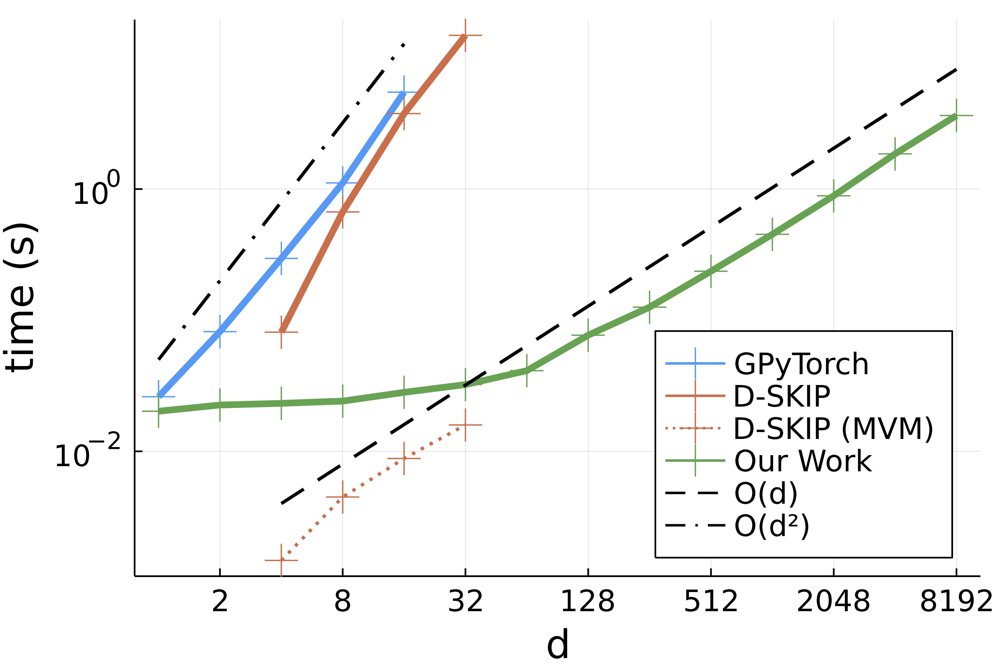
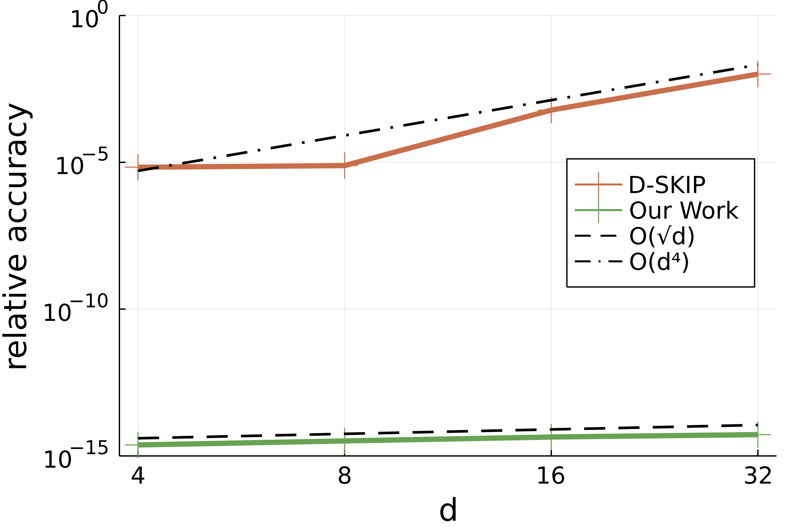

# CovarianceFunctions.jl
[](https://github.com/SebastianAment/CovarianceFunctions.jl/actions/workflows/CI.yml)
[](https://codecov.io/gh/SebastianAment/CovarianceFunctions.jl)
[](http://opensource.org/licenses/MIT)

CovarianceFunctions.jl's primary goal are efficient computations with kernel matrices, also called `Gramian`'s.
To this end, the package implements a *lazy* `Gramian` type, which
can be used to solve linear algebraic problems arising in
kernel methods efficiently without running out of memory.
Further, the code automatically recognizes when certain linear algebraic structures are present and exploits them for computational efficiency, in particular for fast matrix-vector multiplications (MVMs).

Feature highlights include
- [Lazy representation](#basic-usage): kernel matrices with `O(1)` memory footprint and efficient, parallelized MVMs.
- [Gradient observations](#gradient-kernels): `O(n²d)` exact MVMs with kernel matrices arising from GPs with gradient observations, in contrast to the naïve `O(n²d²)` complexity.
- [Hessian observations](#hessian-kernels): `O(n²d²)` exact MVMs with kernel matrices arising from GPs with Hessian observations in contrast to the naïve `O(n²d⁴)` complexity.
- [Toeplitz structure](#toeplitz-structure): `O(n⋅log(n))` exact MVMs and `O(n²)` exact linear solves with isotropic kernel matrices on a uniform grid.
- [Kronecker structure](#kronecker-structure): `O(nᵈ⁺¹)` exact MVMs and `O(nᵈ⁺²)` exact linear solves with separable product kernels matrices on a Cartesian grid in `d` dimensions.
- [Barnes-Hut algorithm](#barnes-hut): `O(n⋅log(n))` approximate MVMs with isotropic kernel matrices.
- [Sparsification](#sparsification): `O(nk⋅log(n))` sparsification of isotropic kernel matrices to specified tolerance with subsequent `O(k)` MVMs, where `k` is the number of non-zeros.

## Basic Usage
This example shows how to construct a kernel matrix using the `gramian` function and highlights the small memory footprint of the lazy representation and the matrix-vector multiplication with `mul!`.
```julia
using CovarianceFunctions
using LinearAlgebra
k = CovarianceFunctions.MaternP(2); # Matérn kernel with ν = 2.5
d, n = 3, 16384; # generating data with large number of samples
x = [randn(d) for _ in 1:n]; # data is vector of vectors

@time K = gramian(k, x); # instantiating lazy Gramian matrix
  0.000005 seconds (1 allocation: 48 bytes)
size(K)
  (16384, 16384)

a = randn(n);
b = zero(a);
@time mul!(b, K, a); # multiplying with K allocates little memory
    0.584813 seconds (51 allocations: 4.875 KiB)
```
On the other hand, instantiating the matrix densely consumes 2GiB of memory:
```julia
@time M = Matrix(K); # instantiating the matrix costs 2GiB
    0.589848 seconds (53 allocations: 2.000 GiB, 4.13% gc time)
```
## Kernels

The package implements many popularly used covariance kernels.

### Stationary Kernels

We give a list of stationary kernels
whose implementations can be found in src/stationary.jl.

1. `ExponentiatedQuadratic` or `EQ` (also known as RBF)
2. `RationalQuadratic` or `RQ`
3. `Exponential` or `Exp`
4. `GammaExponential` or `γExp`
5. `Matern` for real valued parameters `ν`
6. `MaternP` for `ν = p+1/2` where `p` is an integer
7. `CosineKernel` or `Cos`
8. `SpectralMixture` or `SM`

### Non-Stationary Kernels
The  following non-stationary kernels can be found in src/mercer.jl.

9. `Dot` is the covariance functions of a linear function
10. `Polynomial` or `Poly`
11. `ExponentialDot`
12. `Brownian` is the covariance of Brownian motion
13. `FiniteBasis` is the covariance corresponding to a finite set of basis functions
14. `NeuralNetwork` or `NN` implements McKay's neural network kernel

### Combining Kernels
CovarianceFunctions.jl implements certain transformations and algebraic combinations of kernel functions.
For example,
```julia
using CovarianceFunctions
smooth = CovarianceFunctions.RQ(2); # Rational quadratic kernel with α = 2.
line = CovarianceFunctions.Dot(); # linear kernel
kernel = 1/2 * smooth + line^2 # combination of smooth kernel and quadratic kernel
```
assigns `kernel` a linear combination of the smooth Matérn kernel and a quadratic kernel. The resulting kernel can be evaluated like the base kernel classes:
```julia
d = 3
x, y = randn(d), randn(d)
kernel(x, y) ≈ smooth(x, y) / 2 + line(x, y)^2
  true
```

### Using Custom Kernels
It is simple to use your own custom kernel, e.g.
```julia
custom_rbf(x, y) = exp(-sum(abs2, x .- y)) # custom RBF implementation
```
To take advantage of some specialized structure-aware algorithms, it is prudent to let CovarianceFunctions.jl know about the input type, in this case
```julia
CovarianceFunctions.input_trait(::typeof(custom_rbf)) = IsotropicInput()
```
Other possible options include `DotProductInput` or `StationaryLinearFunctionalInput`.
To enable efficient output type inference for custom kernels with parameters,
extend `Base.eltype`.
Since the custom kernel above does not have any parameters, we set the type to the bottom type `Union{}`:
```julia
Base.eltype(k::typeof(custom_rbf)) = Union{}
```
The type of the output of the kernel `k` with inputs `x` and `y` is then expected to be `promote_type(eltype.((k, x, y))...)`.

## Toeplitz Structure

The kernel matrix corresponding to isotropic kernel on a regular grid in one dimension exhibits a special Toeplitz structure.
CovarianceFunctions.jl *automatically* detects this structure,
which can be used for `O(n log(n))` multiplies and `O(n²)` direct solves.
```julia
using CovarianceFunctions
using LinearAlgebra
CovarianceFunctions.Exponential(); # exponential kernel
n = 16384;
x = range(-1, 1, n);

@time G = gramian(k, x);
  0.000572 seconds (3 allocations: 128.062 KiB)
typeof(G) # the algorithm automatically recognized the Toeplitz structure
  ToeplitzMatrices.SymmetricToeplitz{Float64}

a = randn(n);
b = zero(a);
@time mul!(b, G, a); # matrix-vector multiplications are very with G are fast O(n log(n))
  0.001068 seconds (57 allocations: 1.504 MiB)
```

In contrast, instantiating the matrix is much slower and memory-expensive:
```julia
@time Matrix(G);
  0.393198 seconds (2 allocations: 2.000 GiB, 0.89% gc time)
```

While the fast multiplications can be used in conjunction with iterative solvers,
CovarianceFunctions.jl also implements a `O(n²)` direct solver called `levinson`:
```julia
using CovarianceFunctions: levinson
@time x_fast = levinson(G, b); # same as G \ b
  0.172557 seconds (6 allocations: 384.141 KiB)
```
whereas naïvely, this would take two orders of magnitude longer for this problem:
```julia
julia> @time x_naive = Matrix(G) \ b;
 10.494046 seconds (8 allocations: 4.000 GiB, 1.34% gc time)
```
Notably, the results are equal to machine precision:
```julia
x_naive ≈ x_fast
  true
```

## Kronecker Structure

Taking the Cartesian product of `d` vectors with `n` points each gives rise to a regular grid of `nᵈ` `d`-dimensional points.
Kernel matrices constructed with such grids naïvely have a `O(n²ᵈ)`  MVM complexity and `O(n³ᵈ)` inversion complexity.
However, separable (a.k.a. direct) product kernels,
evaluated on such grids give rise to Kronecker product structure,
which allows for much faster `O(nᵈ⁺¹)` multiplies and `O(nᵈ⁺²)` solves, an exponential improvement in `d`.
To see how to exploit this structure, note that CovarianceFunctions.jl can lazily represent a Cartesian grid using `LazyGrid`:
```julia
using LinearAlgebra
using CovarianceFunctions
using CovarianceFunctions: LazyGrid, SeparableProduct
d, n = 3, 128;
x = randn(n);
@time gx = LazyGrid(x, d);
  0.000025 seconds (9 allocations: 288 bytes)
length(gx)
  2097152
```
Now, we'll construct a separable product kernel in `d` dimensions:
```julia
k = CovarianceFunctions.Exp()
p = SeparableProduct(fill(k, d)) # separable product kernel
```
Subsequently calling `gramian` on `p` and the grid `gx` **automatically**
represents the matrix as a lazy `KroneckerProduct` structure,
which we implemented in [KroneckerProducts.jl](https://github.com/SebastianAment/KroneckerProducts.jl):
```julia
@time G = gramian(p, gx);
  0.000023 seconds (11 allocations: 624 bytes)
using KroneckerProducts
G isa KroneckerProduct
  true
```
This allows for very efficient multiplies, factorizations, and solves:
```julia
a = randn(n^d);
size(G)
  (2097152, 2097152)
@time F = cholesky(G);
  0.003127 seconds (155 allocations: 397.344 KiB)
@time F \ a;
  0.062468 seconds (97 allocations: 96.005 MiB)
```
That is, factorizing `G` and solving `F \ a` takes a fraction of a second, despite the linear system having more than **2 million** variables.

Notably, both the Kronecker structure and the constituent kernel matrices are
lazily represented in the general case.
If fast MVMs are required, it is best to instantiate the constituent matrices in memory while keeping the Kronecker product lazy:
```julia
using KroneckerProducts
K = kronecker(Matrix, G) # this instantiates the constituent kernel matrices in memory for fast MVMs
a = randn(n^d);
b = zero(a);
@time mul!(b, K, a);
  0.022626 seconds (50 allocations: 2.016 KiB)
```

Further, note that Kronecker structure can be combined with the [Toeplitz structure](#toeplitz-structure) above to yield
quasi-linear MVMs with the resulting kernel matrix.
This is the basis of the [SKI framework](https://arxiv.org/pdf/1503.01057.pdf).


## Gradient Kernels

When conditioning Gaussian processes on gradient information,
it is necessary to work with `d × d` *matrix-valued* gradient kernels,
where `d` is the dimension of the input.
[Roos et al.](https://proceedings.mlr.press/v139/de-roos21a/de-roos21a.pdf) first noted that isotropic and dot product kernels give rise to gradient kernel matrices with a data-sparse structure and proposed a direct method with an `O(n²d + n⁶)` complexity for the low-data regime, where the number of observations `n` is small.

CovarianceFunctions.jl implements an automatic structure derivation engine for a large range of kernel functions, including **complex composite kernels like MacKay's neural network kernel and the spectral mixture kernel**, permitting an **exact** matrix-vector product in `O(n²d)` operations with gradient kernel matrices.
It also contains a generic fallback with the regular `O(n²d²)` complexity for cases where no special structure is present or currently implemented.
For example,
```julia
using CovarianceFunctions
using LinearAlgebra
k = CovarianceFunctions.MaternP(2); # Matérn kernel with ν = 2.5
g = CovarianceFunctions.GradientKernel(k);
d, n = 1024, 1024; # generating high-d data with large number of samples
x = [randn(d) for _ in 1:n]; # data is vector of vectors
@time G = gramian(g, x); # instantiating lazy gradient kernel Gramian matrix
  0.000013 seconds (1 allocation: 96 bytes)
size(G) # G is n*d by n*d
  (1048576, 1048576)
```
Despite the **million by million matrix**, MVMs are fast:
```julia
a = randn(n*d);
b = zero(a);
@time mul!(b, G, a); # multiplying with G allocates little memory
  0.394388 seconds (67 allocations: 86.516 KiB)
```
This would be impossible without CovarianceFunctions.jl's lazy and structured representation of the gradient kernel matrix.
Note that `GradientKernel` only computes covariances of gradient observations,
to get the `(d+1) × (d+1)` covariance kernel that includes value observations,
use `ValueGradientKernel`.

For linear solves with gradient kernel matrices via `\` or `ldiv!`,
the minimum residual method is used, which in this case only needs a few iterations to converge, since the Matérn kernel we used gives rise to an extremely well conditioned matrix in high dimensions:
```julia
@time b = G \ a;
  0.817458 seconds (127 allocations: 32.167 MiB)
G*b ≈ a
  true
```

To highlight the scalability of this MVM algorithm, we compare against the implementation in [GPyTorch](https://docs.gpytorch.ai/en/stable/kernels.html?highlight=kernels#rbfkernelgrad) and the fast *approximate* MVM provided by [D-SKIP](https://github.com/ericlee0803/GP_Derivatives).

<!-- <p align="center">
    
</p> -->

<p align="center">
  
  <!--  -->
</p>

<!--  -->
The plot above shows MVM times with the exponentiated quadratic (RBF) gradient kernel with `n = 1024` as a function of the dimension `d`.
Notably, GPyTorch's implementation scales with the naïve complexity `O(n²d²)`.
D-SKIP's MVM scales linearly in `d`, but the required pre-processing scales quadratically in `d` and dominates the total runtime.
Further, D-SKIP is restricted to seperable product kernels that give rise to low rank constituent kernel matrices.
The accuracy plot below
compares D-SKIP and CovarianceFunctions.jl's MVM against the naïve dense MVM.
CovarianceFunctions.jl's MVM is mathematically exact and scales linearly with `d` into high dimensions.

<p align="center">
  
</p>

At this time, both GPyTorch and D-SKIP only support two gradient kernels each and the only kernel that is supported by both is the exponentiated quadratic (RBF) gradient kernel.
In contrast, CovarianceFunctions.jl provides scalable `O(n²d)` MVMs
that are accurate to machine precision
for a large class of kernels including all isotropic and dot-product kernels,
and **extends to complex composite kernels like MacKay's neural network kernel and the spectral mixture kernel**.
This is achieved by computing a structured representation of the kernel matrix through a **matrix-structure-aware automatic differentiation**.
The following exemplifies this with a combination of Matérn, quadratic, and neural network kernels using 1024 points in 1024 dimensions:
```julia
matern = CovarianceFunctions.MaternP(2); # matern
quad = CovarianceFunctions.Dot()^2; # second kernel component
nn = CovarianceFunctions.NN(); # neural network
kernel = matern + quad + nn;
g = CovarianceFunctions.GradientKernel(kernel);
@time G = gramian(g, x);
  0.000313 seconds (175 allocations: 56.422 KiB)
size(G) # G is n*d by n*d
  (1048576, 1048576)
@time mul!(b, G, a);
    3.139411 seconds (8.39 M allocations: 424.829 MiB, 0.47% gc time)
```

It is possible to hook a costum kernel into CovarianceFunctions.jl's automatic structure derivation engine, by specifying its input type
using the `input_trait` function.
Basic input traits amenable to specializations are `IsotropicInput`, `DotProductInput`, and  `StationaryLinearFunctionalInput`.
Further transformations and combinations of kernels are also supported, as well as efficient `O(d²)` operations with certain Hessian kernels, in constrast to the naïve `O(d⁴)` complexity.
The main files containing the implementation are src/gradient.jl, src/gradient_algebra.jl, and src/hessian.jl

## Hessian Kernels
In addition to the special structure for gradient kernels,
CovarianceFunctions.jl implements a similar structure for kernels arising from Hessian observations, reducing the complexity of multiplying with Hessian kernel matrices from `O(n²d⁴)` to `O(n²d²)`.
The support for Hessian kernels is less comprehensive than for gradient kernels, but includes isotropic and dot product kernels.
For example,
```julia
using CovarianceFunctions
using LinearAlgebra
k = CovarianceFunctions.EQ(); # exponentiated quadratic (RBF) kernel
h = CovarianceFunctions.HessianKernel(k);
d, n = 16, 128; # keeping dimension moderate
x = [randn(d) for _ in 1:n]; # data is vector of vectors
@time G = gramian(h, x); # instantiating lazy gradient kernel Gramian matrix
  0.000026 seconds (59 allocations: 54.172 KiB)
size(G) # G is n*d² by n*d²
  (32768, 32768)
```
MVMs with the Hessian kernel matrix are fast:
```julia
a = randn(n*d^2);
b = zero(a);
@time mul!(b, G, a); # multiplying with G is fast
  0.076744 seconds (12.81 M allocations: 499.100 MiB, 34.14% gc time)
```
This is in contrast with the naïve approach, since even instantiating the Hessian kernel matrix in memory takes orders of magnitude more time and memory:
```julia
@time M = Matrix(G);
  5.617745 seconds (1.18 M allocations: 64.722 GiB, 33.33% gc time)
```

Notably, the multiplication with the Hessian kernel matrix scales linearly in `d²`, the amount of information gathered per Hessian observation.
While the implementation scales well, the constants and memory allocations are at this point not as optimized as for the gradient kernel matrices.
Feel free to reach out if you'd benefit from a further improved implementation of the Hessian kernel, and I'll fast-track it.

<!-- Similar to linear solves with gradient kernel matrices,
a conjugate gradient method is used on Hessian kernel matrices
whenever `\` or `ldiv!` is called, leading to very efficient solves:
```julia
@time b = G \ a;
G*b ≈ a
  true
``` -->

## Sparsification
Depending on the data distribution, kernel matrices associated with exponentially-decaying kernels can be approximately sparse.
This is particularly likely in higher dimensions, since the average distance of uniformaly distributed points in e.g. the unit hyper-cube grows with the dimension.
CovarianceFunctions.jl contains a sparsification algorithm that extends SparseArrays.jl's `sparse` function,
guaranteeing a user-defined element-wise accuracy.

>:warning: Sparsification does not guarnatee positive definiteness of the resulting matrices. Special care should be taken when working with this method. We thank [David Bindel](https://www.cs.cornell.edu/~bindel/) for pointing this out.

>:warning: The bottleneck in the computation of the sparse `S` is NearestNeighbors.jl's `inrange` function. While in principle the nearest neighbors search based on ball trees is an `O(n⋅log(n))` operation, the complexity grows with the *intrinsic* dimension of the data. Consequently, the search is fast for data on a low-dimensional manifold, but a brute-force search could be more efficient for unstructured data in high dimensions. It is possible to further [accelerate the search through parallelization](https://github.com/KristofferC/NearestNeighbors.jl/pull/131).

```julia
using CovarianceFunctions
using SparseArrays

k = CovarianceFunctions.EQ()
d, n = 32, 16384;
X = randn(d, n);
G = gramian(k, X);

@time S = sparse(G, 1e-6); # sparsification with 1e-6 tolerance
  7.208343 seconds (407.54 k allocations: 73.094 MiB)
```
Looking at the number of non-zeros in `S`, we see it is highly sparse:
```julia
nnz(S) # number of non-zeros in S
  594480
nnz(S) / n^2 # over 99% of entries are sparse
  0.0022146105766296387
```

Subsequent matrix-vector multiplications with `S` are very fast:
```julia
a = randn(n)
b = zero(a)
@time mul!(b, S, a); # sparse multiply
    0.000451 seconds
```
while the lazy dense multiply takes three orders of magnitude longer:
```julia
@time mul!(b, G, a); # lazy dense multiply
  0.949835 seconds (61 allocations: 5.594 KiB)
```
Note that the sparsification in this case takes as much time as 7 lazy dense multiplications, and would therefore break even quickly if an iterative method is used.

## Barnes-Hut
The Barnes-Hut algorithm has its origins in accelerating gravity simulutations, but a variant of it can be applied to kernel matrices arising from more general kernels,
allowing for an approximate matrix-vector multiply in `O(n⋅log(n)⋅d)` operations.
CovarianceFunctions.jl contains the `BarnesHutFactorization` structure whose constructor can be called on a `Gramian` matrix and applies the fast transform whenever `*` or `mul!` is called.

>:warning: Similar to the fast sparsification above, the Barnes-Hut algorithm relies on ball trees to summarize interactions between clusters of data points. While this is guaranteed to be fast for low-dimensional (`d≤3`) data, the complexity of the approach increases with the *intrinsic* dimension of the data.

```julia
using CovarianceFunctions
using LinearAlgebra
k = CovarianceFunctions.EQ();

d, n = 2, 65536;
X = randn(d, n);
G = gramian(k, X);
@time F = CovarianceFunctions.BarnesHutFactorization(G, θ = 1/2);
 0.076532 seconds (720.93 k allocations: 40.189 MiB, 8.65% gc time)
 ```
Notably, constructing `F` computes a Ball tree structure over the data `X`, which allocates memory, but this is an `O(n⋅log(n)⋅d)` operation.
The `θ ∈ [0, 1]` parameter trades off accuracy with speed.
For `θ = 0`, multiplying with `F` is exact but `O(n²)`.
Subsequent multiplications with `F` are fast:
```julia
a = randn(n);
b = zero(a);
@time mul!(b, F, a);
  0.083348 seconds (209.54 k allocations: 15.712 MiB)
```
whereas for `n` of this order of magnitude, the lazy dense multiply takes much longer:
```julia
@time mul!(b, G, a);
  4.938038 seconds (64 allocations: 5.688 KiB)
```
For `θ = 1/2`, we get around 2 digits of accuracy:
```julia
norm(G*a-F*a) / norm(G*a)
  0.011654351196539835
```
By reducing `θ`, we can increase the accurary at the expense of runtime:
```julia
F = CovarianceFunctions.BarnesHutFactorization(G, θ = 1/4); # setting θ = 1/4 instead of 1/2 as above
@time mul!(b, F, a);
  0.223038 seconds (209.67 k allocations: 15.716 MiB)
norm(G*a-F*a)/norm(G*a)
  0.004286540849728051
```

<!-- * more covariance matrix factorizations (HODLR), or approximations (SKI, Nystrom, Random Kitchen Sinks, Fast Food)
* GPLVMs
* chebyshev interpolation
* functional eigendecomposition of kernels as pre-processing step
* `const SmoothKernels = Union{EQ, RQ} -> trylowrank(::SmoothKernels, n::Int) = n > 128` -->
